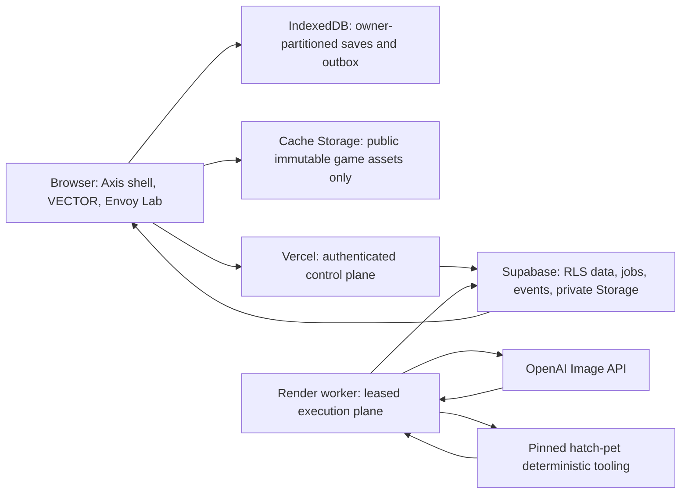

# 15 — VECTOR Arcade and Axis Envoys

- Status: active
- Date: 2026-07-16
- Branch: `codex/vector-arcade-envoys`
- Authority: owner-authorized System Redesign Override (`AGENTS.md` §2a)
- Source brief: `pasted-text-1.txt` SHA-256 `ab7dccf6d91c88941273b4975dee00ba1c89c8295f3587cd7e2cf66593057cd9`

## Program outcome

Ship two production systems, not prototypes:

1. **VECTOR Arcade** — an Axis-native library, shared game runtime, offline-first
   save/sync layer, per-game offline installation, and nine complete games.
2. **Axis Envoys** — a replacement for Mascot/Presence that separates visual
   identity from Focus, Intel, and Ask; shows truthful task/run/approval status;
   and supports private, durable, OpenAI-backed Envoy generation on Render.

All existing financial-safety, approval, privacy, RLS, observability, and
production gates remain binding. No game, Envoy, sync state, progress value, or
worker capability may be presented as real without authoritative evidence.

## Current behavior

- `AppShell` mounts one legacy `Mascot` implementation. Appearance and AI mode
  are coupled through a fixed `companion` union (`monolith | deck | nova`).
- Focus is stored locally; Intel and Ask share the companion AI route but lack
  complete abort/error parity.
- Agent tasks, routine runs, run steps, and approvals are durable, but clients
  load them once or with bounded list queries. Partial query failures can look
  like empty activity, and there is no single truthful active-work projection.
- Phase 9 preference writes persist `{ theme, settings }`; current `main` adds
  the browser IANA timezone. Both must survive integration.
- No `/vector` route, game registry, game runtime, IndexedDB save store, sync
  API, or active service worker exists. A legacy Workbox bundle is tracked but
  is not registered.
- No Envoy generation tables, private bucket, worker, Render blueprint, worker
  heartbeat, OpenAI image client, or vendored hatch-pet runtime exists.

## Intended replacement

- `AppShell` dynamically loads `EnvoyHost`. `activeEnvoyId` chooses appearance;
  `Focus | Intel | Ask` chooses capability. Either can change independently.
- One owner-scoped active-work endpoint projects real task, run, step, approval,
  result, and degradation state into a typed HUD. Unknown progress stays
  indeterminate.
- VECTOR uses one route-isolated Phaser runtime for 2D action/physics games and
  one isolated Three.js runtime for 3D games. Second Sense stays engine-free.
  Each game remains a separate client chunk.
- Game state writes to an owner-partitioned IndexedDB store first. A compact
  idempotent outbox syncs through authenticated APIs to owner-RLS Supabase rows.
- Per-game offline install caches only allowlisted immutable chunks and assets.
  API, Supabase, RSC, authenticated HTML, and private data never enter Cache
  Storage.
- Vercel owns auth, validation, idempotent job creation, quota reservation, and
  read APIs. Render owns long-running generation. Supabase owns job truth,
  fencing, events, private assets, Envoys, and worker health.

## System boundaries

External text, prompts, images, and model output are data. They never grant
authority, select commands, alter worker state transitions, or authorize an
action.

## Binding invariants

1. Gameplay never waits for network I/O.
2. Local data is keyed by `anonymous:<device-id>` or `user:<uuid>` and never
   becomes visible to another account on the same browser.
3. Every Supabase row is owner-scoped unless it is a service-only health row.
4. Authenticated users cannot directly mutate worker-owned job, lease, cost,
   event, asset-validation, or terminal-state fields.
5. Every worker mutation is fenced by a unique lease token and database time.
6. Envoy appearance never changes Focus, Intel, or Ask behavior.
7. Status uses real records. Percent appears only with a true denominator.
8. Envoy status links open the exact task, run, approval, or result.
9. No game loop, worker, audio context, listener, timer, renderer, or animation
   survives route exit, page hide, or disposal.
10. `/vector` does not eagerly load any game engine.
11. User-generated prompts, references, intermediate images, diagnostics, and
    final assets remain private and never enter logs or client Realtime payloads.
12. One upstream hatch-pet version, state machine, artifact contract, and QA
    path serve both fixture and production providers.

## Accepted pre-mortem mitigations

Owner accepted all mitigations on 2026-07-16. No high risk was waived.

| ID | Verified risk | Binding mitigation | Retired by |
|---|---|---|---|
| VE-RISK-001 | Phase 9 preference writes can erase current-main timezone; failed remote reads can overwrite server state. | Fast-forward canonical approval repair, merge `origin/main`, preserve unknown preference-envelope fields, and gate writes on a successful remote read. Add merge/migration regression tests. | Wave 15.1 |
| VE-RISK-002 | IndexedDB saves can leak across account switches. | Owner namespaces, frozen signed-out outbox, explicit anonymous-to-account merge, no implicit cross-owner reads, and privacy controls that enumerate/clear VECTOR data. | Wave 15.2 |
| VE-RISK-003 | A new service worker could cache authenticated/API/private traffic or fail to replace a legacy root worker. | Serve reviewed `/sw.js`, delete known legacy caches on activation, cache only allowlisted same-origin immutable assets, use staging/atomic promotion, and test prior-worker upgrade. | Wave 15.2 |
| VE-RISK-004 | `/api/vector` lacks middleware defense-in-depth and payload controls. | Add prefix guard plus per-handler auth, session-derived owner, strict Zod schemas, byte limits, RLS, and anonymous/cross-user tests. | Wave 15.2 |
| VE-RISK-005 | Required Phaser plus Three adoption can exceed current bundle headroom. | One shared Phaser runtime, one shared Three.js runtime, engine-free Second Sense, isolated loaders, measured per-game additions, no engine in lobby trace, and explicit VECTOR budgets. | Waves 15.2–15.15 |
| VE-RISK-006 | Runtime lifecycle, reduced motion, mobile input, and hidden-tab behavior lack one owner. | One idempotent runtime boundary owns timing, pause, visibility, autosave, pointer capture, audio, WebGL loss, and disposal; resolved motion setting reaches engines. | Wave 15.2 |
| VE-RISK-007 | Hashed Next chunks lack a safe per-game offline manifest. | Generate a deploy-specific immutable manifest after build, install into staging cache, verify completeness/hash, then promote while retaining prior version. | Wave 15.2 |
| VE-RISK-008 | Existing browser matrix cannot prove offline/mobile/lifecycle claims. | Authenticated Chromium and mobile WebKit/Chromium coverage plus per-game interactive logs, offline transitions, account switches, repeated enter/exit, and console-error capture. | Every code wave |
| VE-RISK-009 | Legacy companion settings and Focus storage lack a versioned migration. | Pure parser maps all legacy forms to stable starter IDs, preserves presence and Focus, rejects corrupt values, and writes a versioned preference envelope. | Wave 15.4 |
| VE-RISK-010 | Task/run/approval data cannot produce a truthful live HUD; partial failures look empty. | One active-work adapter returns explicit section degradation, all nonterminal work, typed optional progress, deterministic ranking, bounded Realtime/polling, and safe Sentry capture. | Wave 15.4 |
| VE-RISK-011 | Task/approval transitions race; approval resume can consume authority before successful work. | Land canonical retry-safe resume repair; add atomic expected-state RPC/CAS transitions and exact deep links. Envoy never approves or executes inline. | Waves 15.1, 15.4 |
| VE-RISK-012 | Model-authored Intel paths are unrestricted; AI fallbacks hide provider failure; abort parity is incomplete. | Shared internal route allowlist, typed degraded responses, safe server telemetry, and AbortController parity for Focus/Intel/Ask. | Wave 15.4 |
| VE-RISK-013 | Owner RLS cannot protect worker-controlled columns. | No direct authenticated job/event mutation. Narrow create/cancel RPCs for users; claim/lease/event/terminal RPCs service-role-only with fixed `search_path` and revoked public execution. | Wave 15.6 |
| VE-RISK-014 | Reclaimed jobs can still be written by stale workers. | New lease token/epoch on every atomic claim; token required for every heartbeat, event, artifact, retry, and terminal mutation; database `now()` is authoritative. | Waves 15.6–15.7 |
| VE-RISK-015 | Job-row heartbeat cannot prove idle worker health. | Dedicated service-only worker heartbeat table with release, vendored commit, provider state, capabilities, and bounded freshness. | Wave 15.6 |
| VE-RISK-016 | In-memory/serverless rate limits cannot enforce concurrency or spend. | Transactional Postgres active-job uniqueness, daily quota ledger, idempotency uniqueness, cost reservation/reconciliation, and fail-closed creation. Upstash remains defense in depth. | Wave 15.6 |
| VE-RISK-017 | Hatch scripts accept paths and destructive reuse; raw exceptions can leak prompts/paths. | Fresh worker-owned temp directory, path-containment assertions, validated private object keys, `spawn`/`execFile` arrays, no `--force`, allowlisted telemetry only. | Wave 15.7 |
| VE-RISK-018 | SDK retries and local-only intermediates can multiply cost after crash. | OpenAI `maxRetries: 0`, explicit abort timeout, persisted attempt before call, bounded app retry, private hashed checkpoint after each accepted expensive result, resumable stage manifest. | Wave 15.7 |
| VE-RISK-019 | Production QA needs independent model judgments and all calls affect cost. | Three stateless blind reviewers, separate labeled final QA, deterministic validators authoritative, all model calls included in reservation/usage accounting. | Wave 15.7 |
| VE-RISK-020 | Existing CI ignores a separate Node/Python/container worker. | Worker lockfile and scripts; CI install/typecheck/unit/integration, vendored hash, Python fixtures, Docker build, Node 24/Pillow/WebP verification, production-impossible fixture provider. | Wave 15.7 |
| VE-RISK-021 | Only GitHub is operational for gate execution; the other hosted services lack the required credentials or authorized sessions. | Production Supabase, Vercel, Render, OpenAI, and Sentry gates remain explicitly `BLOCKED` until the named human owner completes the recorded check. Discover secure access without printing secrets; pinned CLIs may be installed only when required. | Wave 15.16 |

## Simplification pass

Required `caveman` review removed avoidable architecture:

- two browser engines: shared Phaser for required 2D action/physics and shared
  Three.js for 3D; Second Sense uses native DOM/Canvas only;
- one registry and one runtime contract;
- one local database and one sync endpoint family;
- one active-work projection rather than direct HUD fan-out;
- one generation job machine and one private asset contract;
- one deterministic worker adapter with fixture and OpenAI providers;
- one service worker with allowlisted caches, not general PWA interception;
- no realtime-only correctness: Realtime accelerates, bounded polling verifies.

## Wave 15.0 design evidence

- VECTOR lobby/card/mobile/light sheet:
  `.logs/vector-envoys/concepts/vector-lobby-concepts-v1.png`
- Eight-Envoy concept sheet:
  `.logs/vector-envoys/concepts/envoy-concepts-v1.png`
- Envoy HUD/quick-picker/Lab/mobile/light sheet:
  `.logs/vector-envoys/concepts/envoy-ux-concepts-v1.png`
- Multi-skill synthesis and rejection record:
  `.logs/vector-envoys/design-review.md`
- Reusable prompts and SHA-256 output manifests:
  `.prompts/vector/manifest.json` and `.prompts/envoys/manifest.json`

Instrument Deck, Mission Plate, Save Strip, and compact Work Card are selected.
Generated sheets are concept evidence, not shippable UI or final game covers.
All product copy remains DOM text. Starter Envoys remain candidates until full
hatch-pet generation and deterministic QA pass.

## Dependency-ordered waves

| Wave | Outcome | Completion evidence |
|---|---|---|
| 15.0 | Plans, accepted risks, ADRs, design concepts, prompt/evidence indexes | Docs, concept assets, reviews, state/ledger update, commit |
| 15.1 | Integrate canonical approval retry and current `main`; harden preferences and transition races | Merge evidence, focused regression tests, full gates |
| 15.2 | VECTOR registry/runtime/lobby, IndexedDB, sync APIs/schema/RLS, safe per-game offline install | Applied migration, RLS matrix, runtime/persistence/offline tests, browser evidence |
| 15.3 | Second Sense complete vertical slice | Play log, saves/sync/offline/daily/scoring evidence |
| 15.4 | Envoy core refactor, truthful status HUD, deep links, mode parity, quick picker, Envoy Lab shell | State/parity/deep-link/error/a11y/browser tests |
| 15.5 | Starter Envoy concepts and validated hatch-pet packages | Prompts, contact sheets, QA media, `pet.json`, spritesheets, visual review |
| 15.6 | Generation schema, private Storage, RLS/RPCs, quotas, control-plane APIs | Applied migration, grant/RLS/concurrency tests, capability contract |
| 15.7 | Vendored hatch-pet worker, OpenAI provider, Render deployment, live generation | Container/CI, healthy heartbeat, live job, private package, logs/Sentry |
| 15.8 | Brickrise | Complete run and full game evidence |
| 15.9 | Time to Fly | Five levels and deterministic physics evidence |
| 15.10 | Paper Glider | 3D sustained-play and disposal evidence |
| 15.11 | Envoy Arena | Eight shared Envoys and arena evidence |
| 15.12 | Phantasy Axis | Complete bounded RPG run evidence |
| 15.13 | Biome Lab | Deterministic simulation/control evidence |
| 15.14 | MiniTown | Block/road/day-night/management evidence |
| 15.15 | Neon Rift | Complete FPS mission and GPU/disposal evidence |
| 15.16 | Cross-game controller, achievements, offline, accessibility, performance, security, production convergence | Full requirement audit, previews, Sentry, draft PR |

Game order remains binding. Envoy waves may occur between games because Envoy
Arena depends on the shared Envoy registry, but no later game starts before the
previous game is complete.

## Rollback and forward-fix posture

- Migrations are additive. App paths remain backward compatible until each new
  path passes parity and browser gates.
- Legacy `Mascot` remains available behind an internal rollback switch until
  Envoy parity passes; it is removed only in the same verified wave that makes
  EnvoyHost authoritative.
- Save-schema migrators preserve original snapshots. Failed migrations create a
  visible conflict/error record; they never overwrite source data.
- Offline manifests retain the prior complete cache until the next version is
  verified and atomically promoted.
- Worker releases carry a capability version. Vercel refuses incompatible or
  stale workers. Existing jobs stay readable and cancellable during rollback.
- Destructive schema rollback is forbidden. Use forward fixes and feature
  disablement when a production defect appears.

## Definition-of-done evidence index

Detailed game requirements live in `docs/vector/PLAN.md`; Envoy and worker
requirements live in `docs/envoys/PLAN.md`. Per-wave proof belongs in
`.logs/vector-envoys/`. `PROGRAM_STATE.json` is a concise resume index, not a
replacement for logs.

`docs/axis-redesign/15-completion-matrix.md` preserves every source requirement,
its original line range, current status, and direct evidence needed for closure.

No row may be marked complete from code presence alone. Required proof includes
runtime interaction, test coverage matching the claim, migration target state,
RLS/grant read-back, bundle/runtime measurements, preview behavior, and safe
post-preview observability review.
